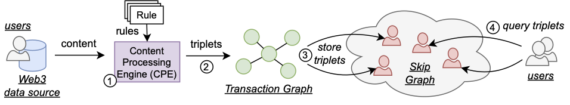

## DeScan: Censorship-Resistant Indexing and Search for Web3

DeScan is a censorship-resistant indexing and search engine for Web3 transactions.
The projects' aim is to offer a decentralized alternative to storing and searching Web3 transactions.
DeScan achieves this by having users index their local Web3 transactions.
These transactions are organized in a Knowledge Graph.
Elements of the knowledge graph are stored amongst users and this process is coordinated by maintaining a Skip Graph overlay.
The figure below provides the architectural overview of DeScan.



Full protocol details and experimental results can be found in our pre-print paper, which can be found [here](https://papers.ssrn.com/sol3/papers.cfm?abstract_id=4333335).

DeScan is built using the [IPv8 networking library](https://github.com/tribler/py-ipv8) which should also be installed prior to running DeScan.
Peer-to-peer communication proceeds using the EVA protocol, a binary transfer protocol based on TFTP.
Full technical details can be found in our publicly available pre-print paper, linked above.

### Project Status

This repository contains a proof-of-concept implementation of DeScan.
The current implementation has been extensively evaluated based simulations and various scenarios. Current version, however, is not suitable for a production deployment as it lacks a persistent layer and stores all information in memory. Adding the persistent layer would be the key next development of the DeScan project.

### Organization

Simulations can be found in the `simulations` directory and all unit tests can be found in the `tests` directory.

The `descan` module with the main implementation of DeScan contains the following three-submodules:
- `core`: contains logic related to the core of DeScan, for example, rules, the content processing engine (CPE) and the overlay logic to maintain the decentralized knowledge graph.
- `eva`: contains the binary transfer protocol for bulk data transfers between peers.
- `skipgraph`: a standalone implementation of the Skip Graph. This is mostly an IPv8 overlay.

### Running the Tests

The DeScan repository contains unit tests to help verifying the correctness of the different components.
You can run these tests with `pytest` as follows:

```
export PYTHONPATH=$PWD  # Ensures that DeScan can find the required modules
pytest tests
```

### Reproducing the Experiments

In our technical report we have evaluated the scalability, robustness and censorship-resistance of DeScan.
All simulations can be found in the `simulations` directory.
The README.md file in that directory provides detailed instructions on the simulation structure and on how to run these simulations yourself.

### Contributing to DeScan

Contributions to DeScan are very much welcomed!
Feel free to create a new issue or open a pull request if you wish to make code contributions.

### Reference

If you found DeScan useful for your work, please cite it as follows:

```
@article{descan,
  title={Descan: Censorship-Resistant Indexing and Search for Web3},
  author={de Vos, Martijn and Ishmaev, Georgy and Pouwelse, Johan},
  journal={Preprint - available at SSRN 4333335}
}
```

_This work is funded by the Ethereum Foundation under grant FY22-0833._
